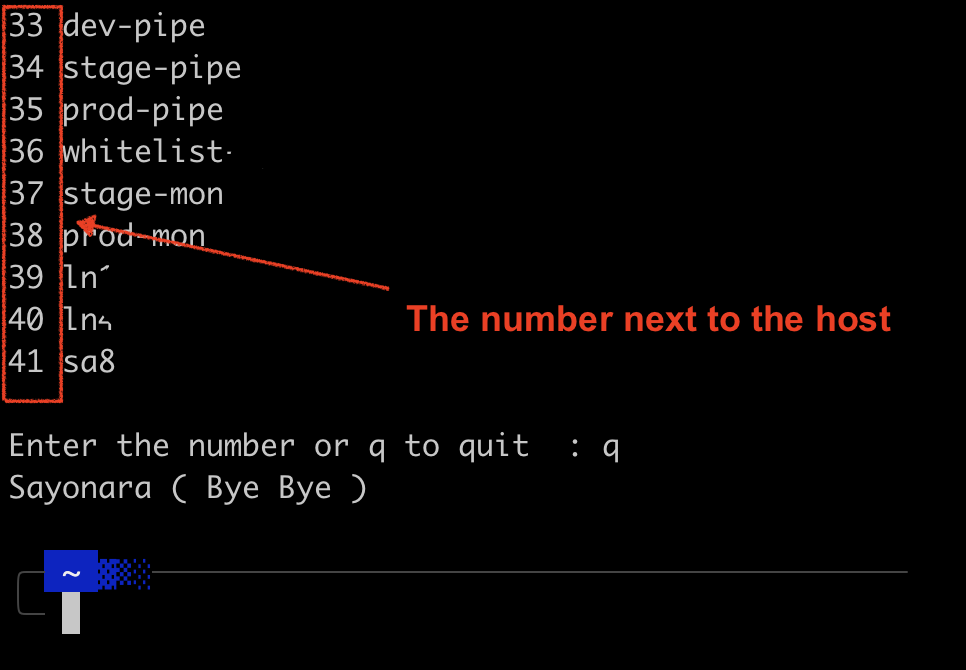

# sushi:  A happy way of SSHing to your remote machine
<br>

A ssh menu for ~/.ssh/config. This is a free to use application and does not comes with any warranty. 

# Prerequisite
The `~/.ssh/config` file must be define according to SSH syntax.

Eg:
```
Host myshotname
  HostName hostname.example.com
  User myusername
```

# How To Install
- Download
`curl -O https://raw.githubusercontent.com/aburayyanjeffry/sushi/main/src/sushi`

- Make it executable
`chmod +x sushi`

- Move it to `bin` directory
`mv sushi ~/bin`
 or
`sudo mv sushi /usr/local/bin`
 
# How to Use
Just call for the `sushi`. It will arrange the hosts in sequence with numbers. Enter the number next to the host's name to SSH to the hosts or enter `q` to exit.

```
sushi
```

To vim '~/.ssh/config" just do
```
sushi conf
``` 

Sample screenshot:
<br>
